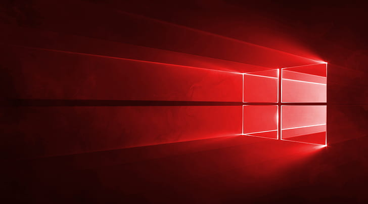

<a id="readme-top"></a>

<!-- PROJECT SHIELDS -->

[![Contributors][contributors-shield]][contributors-url]
[![Forks][forks-shield]][forks-url]
[![Stargazers][stars-shield]][stars-url]
[![Issues][issues-shield]][issues-url]
[![Unlicense License][license-shield]][license-url]

<!-- Description -->
<br />
<div align="center">
  <a href="https://github.com/xcalts/offensive-windows-setup">
    
  </a>
  <h3 align="center">offensive-windows-setup</h3>
  <h4 align="center" style="color:red;">⚠️ Warning: Use at your own risk! For VMs only. ⚠️</h4>
  <p align="center">
    A PowerShell script that sets up a Windows machine tailored for offensive tools development.
    <br />
    <br />
    <a href="https://github.com/xcalts/offensive-windows-setup/issues/new?labels=bug&template=bug-report---.md">Report Bug</a>
    &middot;
    <a href="https://github.com/xcalts/offensive-windows-setup/issues/new?labels=enhancement&template=feature-request---.md">Request Feature</a>
  </p>
</div>

<!-- Table of Contents -->
<details>
  <summary>Table of Contents</summary>
  <ol>
    <li><a href="#usage">Usage</a></li>
    <li><a href="#contributing">Contributing</a></li>
    <li><a href="#license">License</a></li>
    <li><a href="#acknowledgments">Acknowledgments</a></li>
  </ol>
</details>

<!-- Usage -->

## Usage

Open a terminal as admin and execute:

```text
git clone https://github.com/xcalts/offensive-windows-setup
cd ./offensive-windows-setup
./install.ps1
```

<p align="right">(<a href="#readme-top">back to top</a>)</p>

<!-- Contributing -->

## Contributing

1. Fork the Project.
2. Create your Feature Branch (`git checkout -b feature/cool_stuff`).
3. Commit your Changes (`git commit -m 'Add some cool_stuff'`).
4. Push to the Branch (`git push origin feature/cool_stuff`).
5. Open a Pull Request.

<p align="right">(<a href="#readme-top">back to top</a>)</p>

<!-- License -->

## License

Distributed under the GNU GENERAL PUBLIC LICENSE. See `LICENSE` for more information.

<p align="right">(<a href="#readme-top">back to top</a>)</p>

<!-- Acknowledgments -->

## Acknowledgments

- [Best-README-Template](https://github.com/othneildrew/Best-README-Template)

<p align="right">(<a href="#readme-top">back to top</a>)</p>

<!-- MARKDOWN LINKS & IMAGES -->
<!-- https://www.markdownguide.org/basic-syntax/#reference-style-links -->

[contributors-shield]: https://img.shields.io/github/contributors/xcalts/offensive-windows-setup.svg?style=for-the-badge
[contributors-url]: https://github.com/xcalts/offensive-windows-setup/graphs/contributors
[forks-shield]: https://img.shields.io/github/forks/xcalts/offensive-windows-setup.svg?style=for-the-badge
[forks-url]: https://github.com/xcalts/offensive-windows-setup/network/members
[stars-shield]: https://img.shields.io/github/stars/xcalts/offensive-windows-setup.svg?style=for-the-badge
[stars-url]: https://github.com/xcalts/offensive-windows-setup/stargazers
[issues-shield]: https://img.shields.io/github/issues/xcalts/offensive-windows-setup.svg?style=for-the-badge
[issues-url]: https://github.com/xcalts/offensive-windows-setup/issues
[license-shield]: https://img.shields.io/github/license/xcalts/offensive-windows-setup.svg?style=for-the-badge
[license-url]: https://github.com/xcalts/offensive-windows-setup/blob/master/LICENSE.txt
